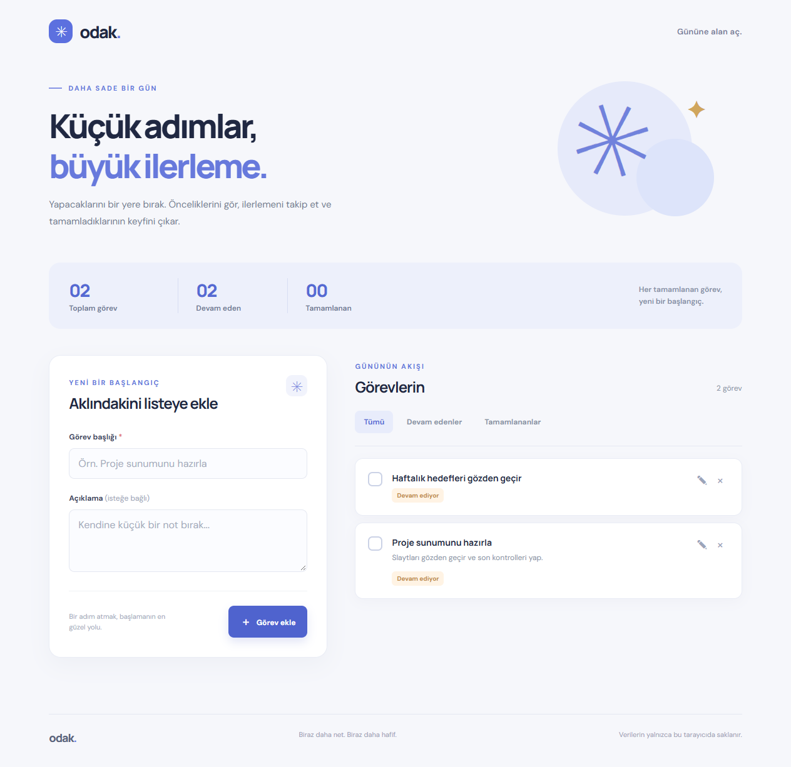

# Odak — Görev Takip

Tarayıcıda çalışan, Türkçe bir görev takip uygulaması. Görev ekleme, listeleme, düzenleme, durum değiştirme ve silme işlemlerini destekler. Veriler aynı tarayıcının LocalStorage alanında saklanır; hesap veya sunucu gerekmez.

**Canlı uygulama:** https://odak-gorev-takip-kucukenes17.netlify.app/

## Teknolojiler

- React ve Vite
- JavaScript
- Düz CSS
- LocalStorage

## Yerel çalıştırma

Node.js ve npm kurulu olmalıdır.

```bash
npm install
npm run dev
```

Terminalde gösterilen yerel adresi tarayıcıda açın. Üretim derlemesini kontrol etmek için:

```bash
npm run build
npm run preview
```

## Kullanım

1. Başlık ve isteğe bağlı açıklama yazarak **Görev ekle** düğmesine basın.
2. Görevlerinizi listede ve durum sekmelerinde görüntüleyin.
3. Onay kutusuyla görev durumunu değiştirin; kalem simgesiyle başlık veya açıklamayı düzenleyin.
4. Çarpı simgesiyle görevi, onay verdikten sonra silin.

Veriler yalnızca kullanılan tarayıcıda tutulur. Tarayıcı verileri temizlenirse görevler de silinir; farklı cihazlar arasında eşitlenmez.

## Yayınlama

Uygulama Netlify'da `odak-gorev-takip-kucukenes17` projesi olarak yayımlanmıştır. `netlify.toml` derleme komutunu (`npm run build`) ve yayın dizinini (`dist`) tanımlar. Bu depo Netlify'a otomatik dağıtım için bağlanmamıştır; yeni sürüm yayımlamak için proje klasöründe Netlify CLI ile `netlify deploy --prod --dir dist` komutunu çalıştırın.

## Ekran görüntüsü


